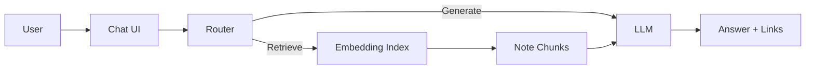

# AI Assistant (Mathnuscripts)

Design for “Ask Mathenge” and RAG over the vault.

## Capabilities

- Natural-language Q\&A over vault + essays
- Suggest related notes and reading paths
- Draft essays from clustered topics

## High-level Design

## Sources

- [[Mathnuscripts]]
- [[Home]]
- [[Digital Mind]]
- [[Publishing (Mathnuscripts)]]
