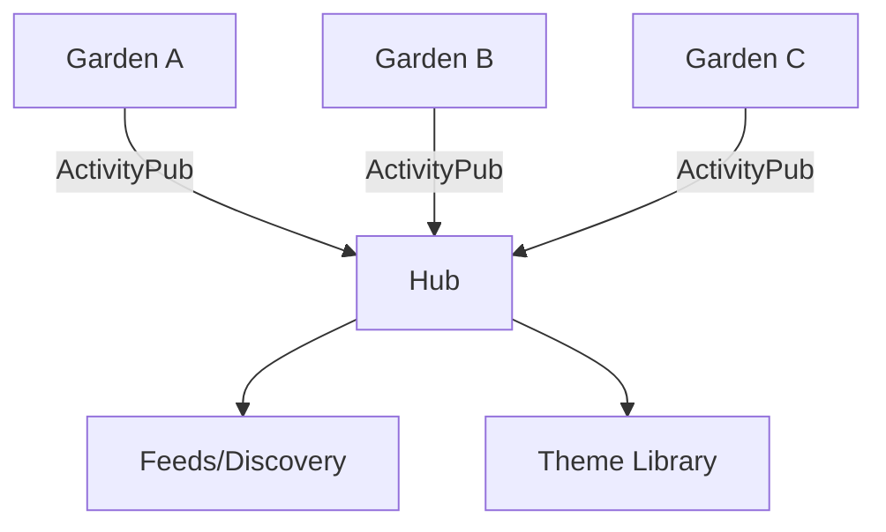

# Garden Network (Mathnuscripts)

Concept for a network of personal digital gardens.

## Principles

- Own your notes, share your garden
- Interoperate via open protocols (ActivityPub)
- Curate themes and recommendations

## Concept Diagram

## References

- [[Mathnuscripts Master Plan]]
- [[Publishing (Mathnuscripts)]]
