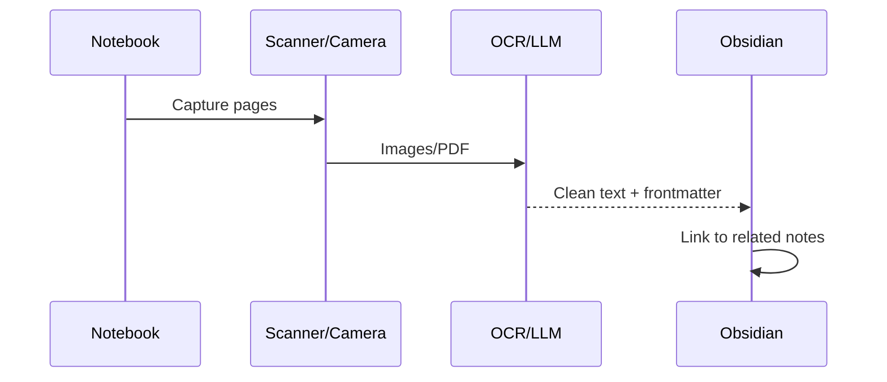

# Handwritten to Digital (Mathnuscripts)

Approaches and workflow for converting notebooks to searchable notes.

## Methods

- Scan to PDF → OCR → Import
- Voice read-through → STT transcript → Summarise
- Smart pens / digital notebooks
- Telegram → LLM transcription → Obsidian note

## Workflow

## References

- [[Turning Handwritten Notes to Digital Notes]]
- [[Problems to Solve]]
- [[Building My Knowledge Base]]
