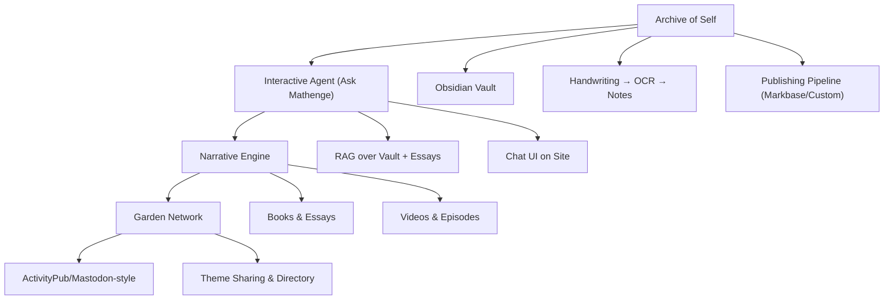

# Mathnuscripts Hub

A curated gateway to the ideas, plans, and systems behind the `Mathnuscripts`. Use this hub to navigate definitions, roadmap, publishing architecture, and AI features.

## Overview

## Start Here

- [[What are the Mathnuscripts]]
- [[Mathnuscripts]]
- [[Home]]

## Sections

- [[Vision (Mathnuscripts)]]
- [[Roadmap (Mathnuscripts)]]
- [[Publishing (Mathnuscripts)]]
- [[Handwritten to Digital (Mathnuscripts)]]
- [[AI Assistant (Mathnuscripts)]]
- [[Garden Network (Mathnuscripts)]]
- [[Mathnuscripts — A Living System of Mind]]

## Related Notes

- [[Publishing My Second Brain]]
- [[Mathnuscripts Master Plan]]
- [[Problems to Solve]]
- [[Building My Knowledge Base]]
- [[Digital Mind]]
- [[Index of Essays]] · [[Index of Notes]]
