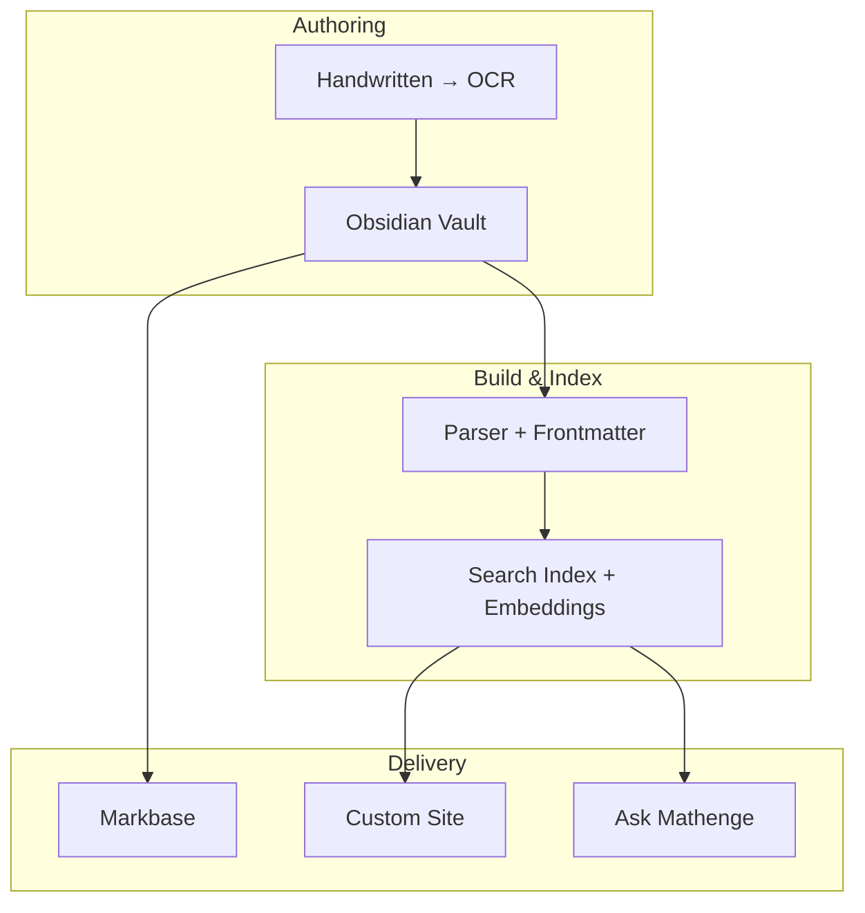

# Publishing (Mathnuscripts)

Centralised view of publishing across Markbase and a custom site.

## Current

- Markbase: `https://mathnuscripts.markbase.xyz/Home`
- Obsidian Digital Garden plugin for hosting

## Target Architecture

## Links

- [[Publishing My Second Brain]]
- [[Mathnuscripts]]
- [[Home]]
